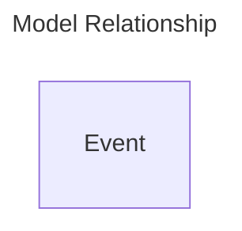

# Events App

Events app manage events. This app permit to keep history on some changes if necessary.  
In some cases, this permit to replay a process or revert it.  
The main usage is to permit apps to share informations between there bounded context. This is the most important app to allow others apps to evolve with a relative independence. Only event payload "contract" matter.

## Model Objects

### Details

- **Event**: Represent an event trasmitted by event bus.

### Entities Relationship Diagram

