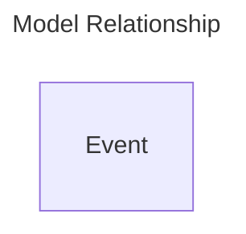

# Events App

Events app manage events. This app permit to keep history on some changes if necessary.  
In some cases, this permit to replay a process or revert it.  
The main usage is to permit apps to share informations between there bounded context. This is the most important app to allow others apps to evolve with a relative independence. Only event payload "contract" matter.

## Model Objects

### Details

- **Event**: Represent an event trasmitted by event bus.

### Entities Relationship Diagram

## Model Behavior

When an app emit an event using eventbus, an event object is created and stored in memory.  
When the eventbus context end, automatically all events are saved in database an events are sent to all subscribers.  
You can exclude an event from save, by adding a *_save* parameter in event data, with the value "False".  
This *_save* option, limits the impact of events in the database. Some events are not critical or are just a consequence of another event.
