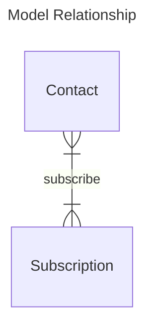

# Notifications App

Notifications app send messages to users, in some ways (Email, Telegram...).  
Based on events with some specific observers.

## Model Objects

### Details

- **Contact**: Represent a person or a group (mailing list ou Telegram group) with only one contact information.
- **Subscription**: It's like a magazine subscription, a user can register a subscription on some events and receive notification via the medium of his/her choice.

### Entities Relationship Diagram

