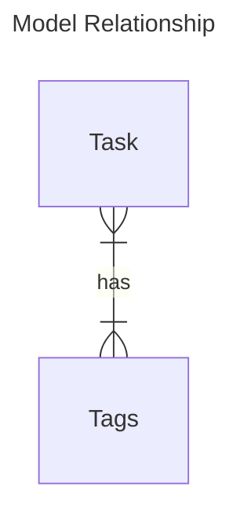

# Tasks App

Tasks app is in charge of task management.  
Tasks ownership is depending on the tenant. We are using a tenant_id to refer to this entity, most of the time, it's a group ([see users app](../users/index.md)).

## Model Objects

### Details

- **Task**: Represent a *task* to do. A *task* may need less to 24 hours to be done. If a *task* need more time to be done, the *task* should be splitted.
- **Tag**: It's a optionnal text you can associate with *tasks* to organise them. You can organise your *tasks* in many ways with *tags*: a *tag* can represent a status, a project, a priority and so on.

### Entities Relationship Diagram

