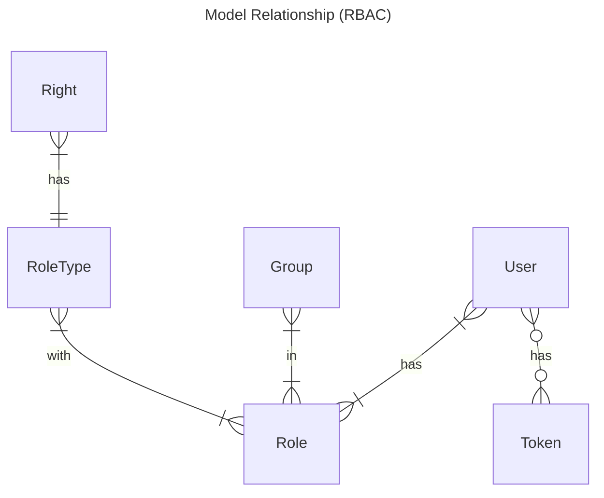
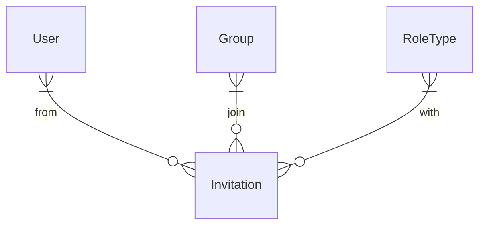

# Users App

Users app is in charge of authentication and authorizations/permissions.  
This app use an RBAC approach (Role Based Access Control).

## Model Objects

### Details

Following models may be directly managed by users:

- **User**: Represent a physical person.
- **Group**: Represent a *group* of *users* that want to work together.
- **Right**: For each *entity* in app, a *user* can have *rights* like: read, create, update, delete, execute or subscribe...
- **RoleType**: A *roletype*, is a preconfigured or a *user* configured combination of *rights* on some entities.
- **Role**: It's the link between *group*, *users* and *roletype*. A *user* can have as many *roles* as *groups* membership.
- **Invitation**: Is a demand for a *user* to join a *group* with a *roletype*. The *user* may be registered or not.

This others models are indirectly created by users via some actions:

- **RequestChange**: Is created temporarily when a user want to change it's email or it's password.
- **Token**: Is created for each successful login attempt.

### Entities Relationship Diagram

